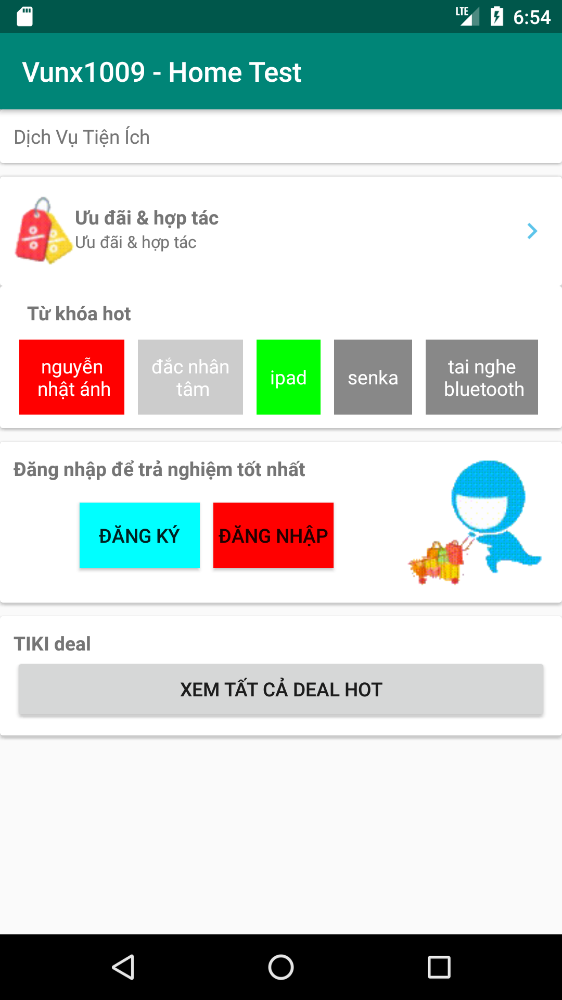

# Vu Xuan Nguyen - Home Test

The demo application is a simple Android application which implements the requirements for loading keyword list. Please see the designed Home Screen in the below picture.

 

The implementation are:

 * [x] If the keyword is more than one word, then display in two lines.
 * [x] Background color is random.
 * [x] Keywords is fetched from keywords.json file in asset directory in background thread.
 * [x] Write a simple unit test(KeywordTool Test.class) for parsing keyword before displaying
 * [x] I used a Builder pattern for loading keyword list.
 
If you have any questions about this application please contact me via email(vunx1009@gmail.com)