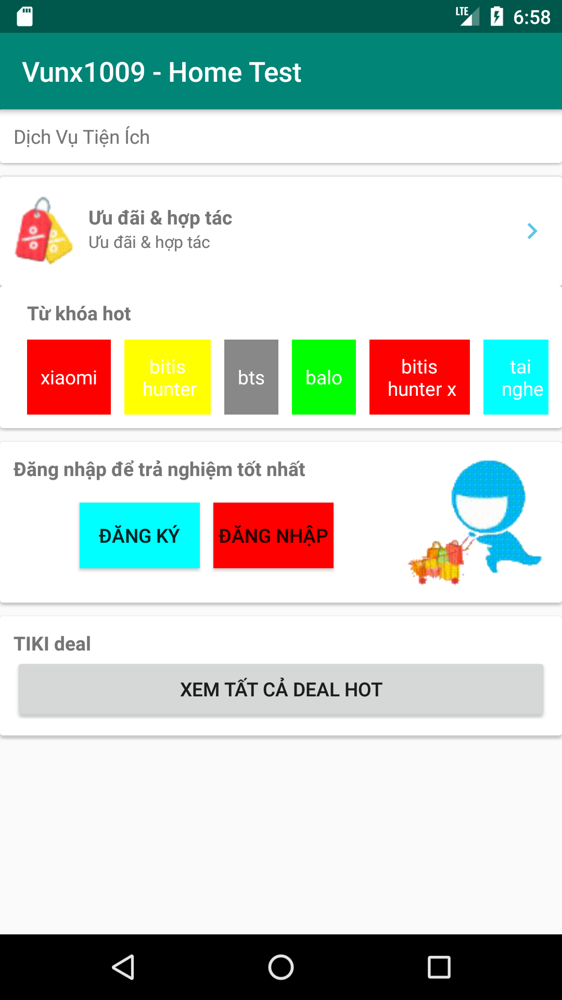

# Vu Xuan Nguyen - Home Test

A Demo app is a simple Android application that implement the requirement for loading keyword list.
The home screen designed as below:

 

The implementation are:

 * [*] If the keyword is more than one word, then display in two lines.
 * [*] Background color is random.
 * [*] Keywords can be fetched from asset.
 * [*] Write a unit test(KeywordUtilTest.class) for parsing keyword before displaying
 * [*] I used builder pattern for loading keyword list.